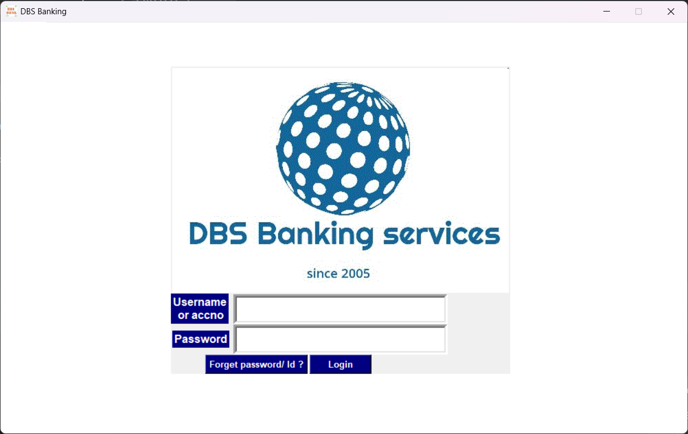
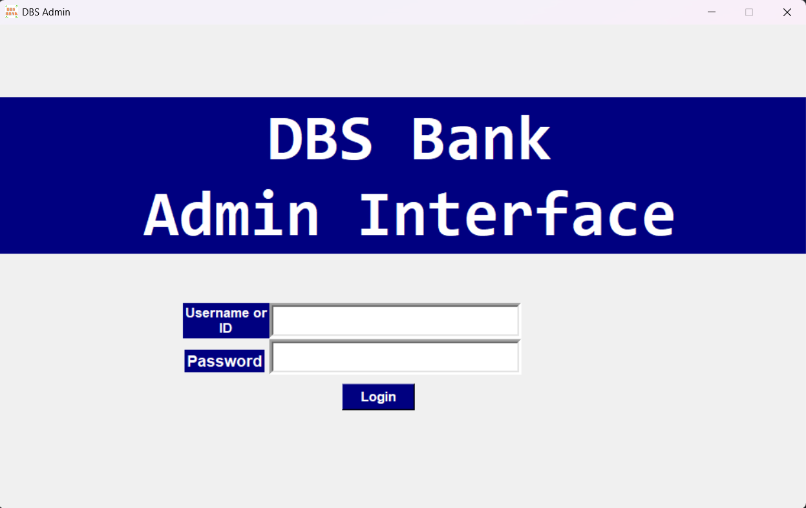

# DBS Banking System

A desktop-based GUI banking system developed using **Python**, **Tkinter**, and **MySQL**, with separate interfaces for **customers** and **admins**. This project simulates core banking operations such as login, balance check, fund transfer, and receipt generation, along with admin functionalities for managing user accounts.

### Key Highlights:
- Built with Python’s `tkinter` for the front-end interface.
- Uses an **online MySQL database** for data storage and operations.
- **Customer Module**:
  - Login via account ID or number
  - View balance, profile, and transaction history
  - Transfer funds to other accounts
  - Reset password via registered Gmail
  - Generate and save PDF transaction receipts
  - Send messages to the bank
- **Admin Module**:
  - Login and manage customer records
  - View and respond to customer messages
  - Block/unblock customer accounts

Database credentials are managed in a separate `config.py` file with placeholders to ensure secure and public-friendly uploads.

# How to Run
## Install Required Libraries
Use pip to install the required Python packages:
```pip install fpdf mysql-connector-python```

## Configure Database Connection
Open the `config.py` file and fill in your MySQL database credentials:

## Set Up the Database
Run the `DB_Creating.py` script below to create the database and necessary tables:

## Run the Applications
-To launch the Customer Interface, run the `main.py` script
-To launch the Admin Interface, run the `Admin.py` script

## Screenshots

### Customer Login


### Admin Panel


