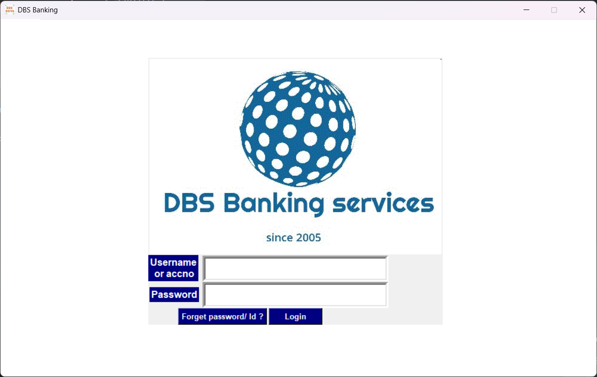
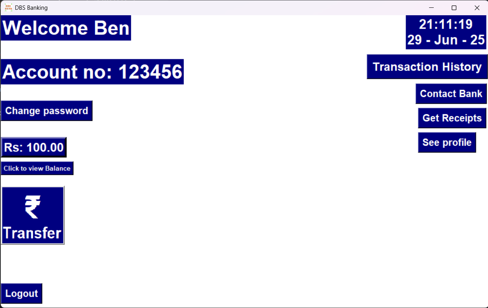
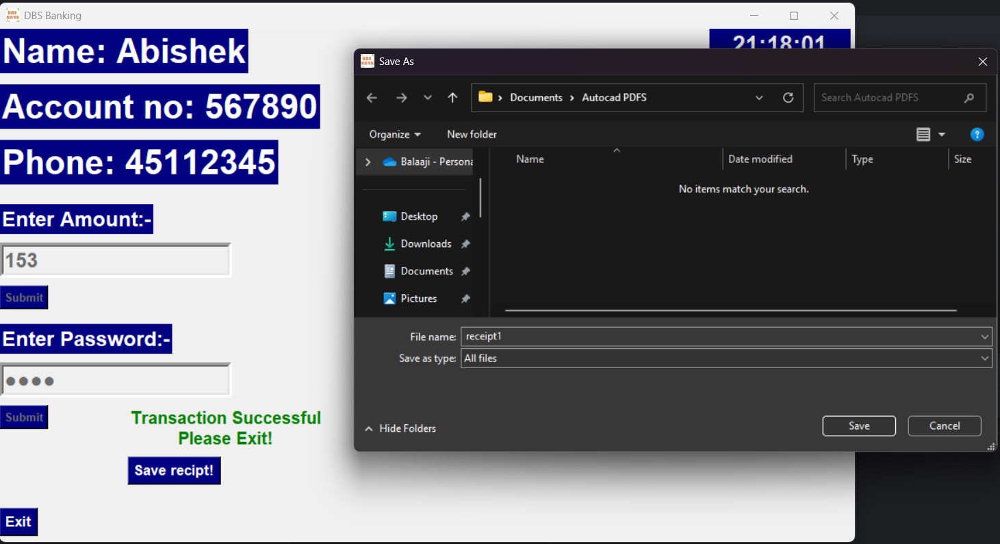
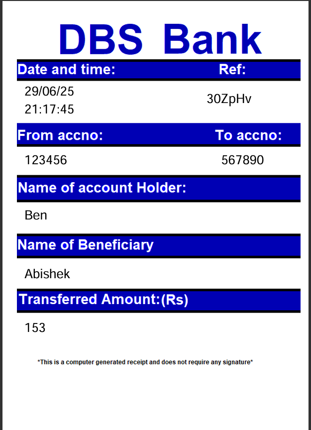
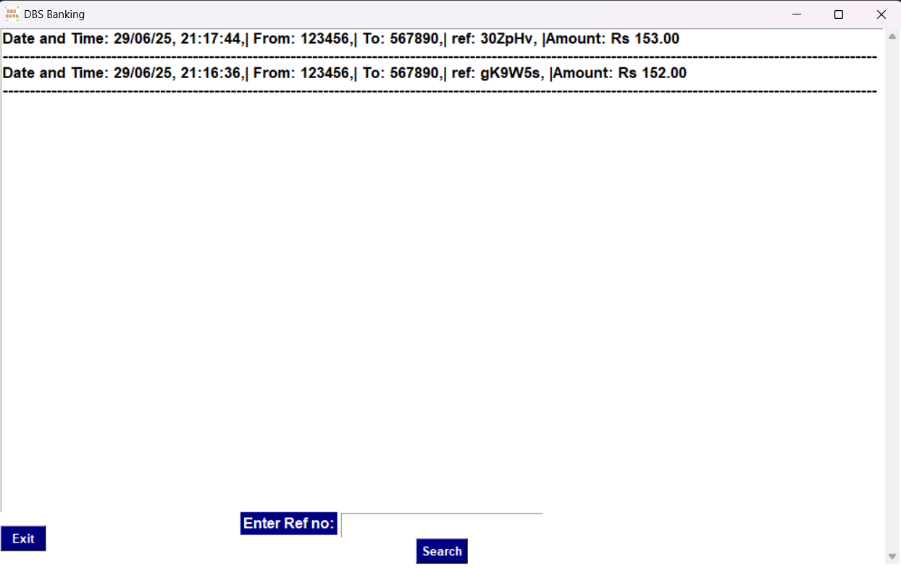
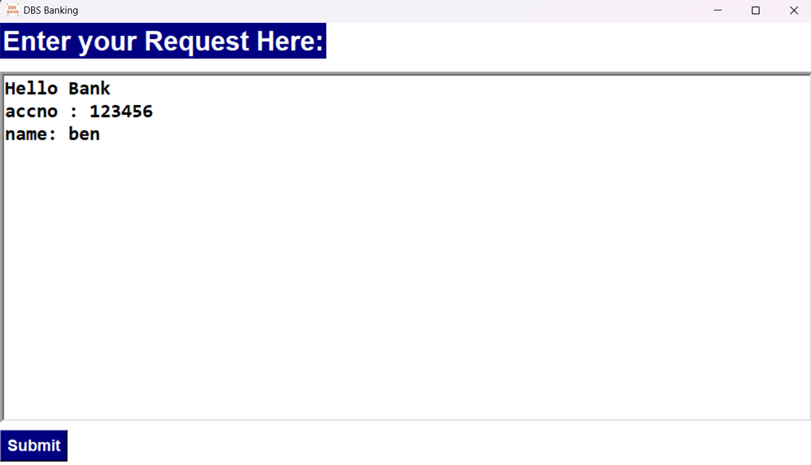
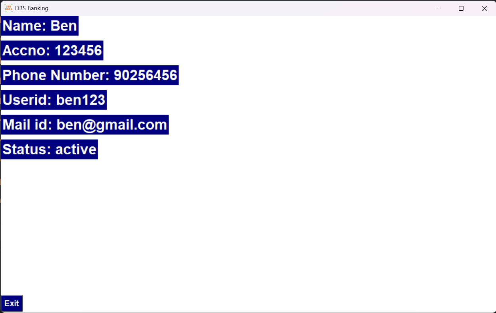
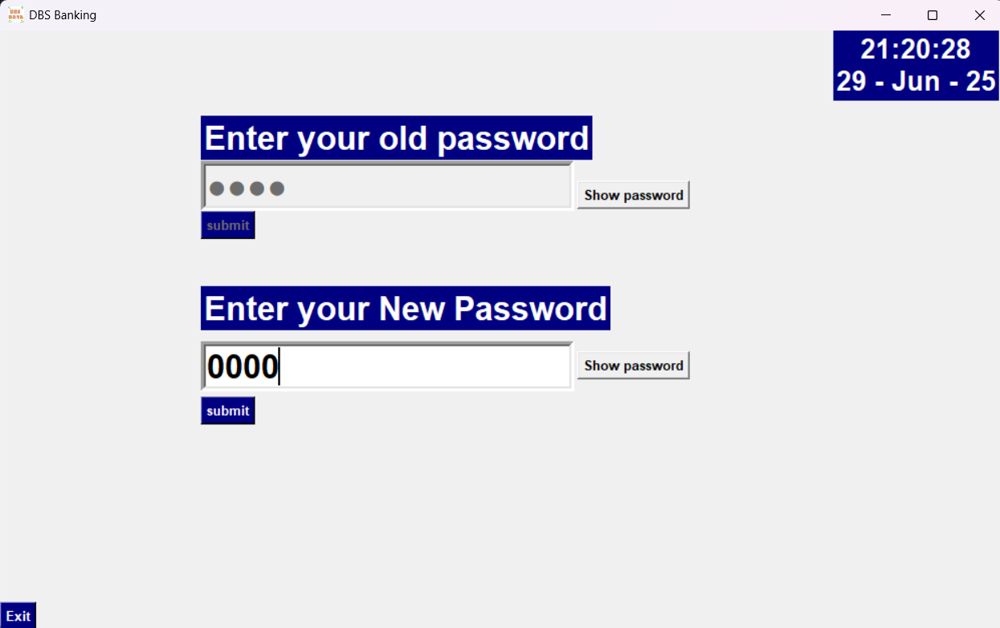
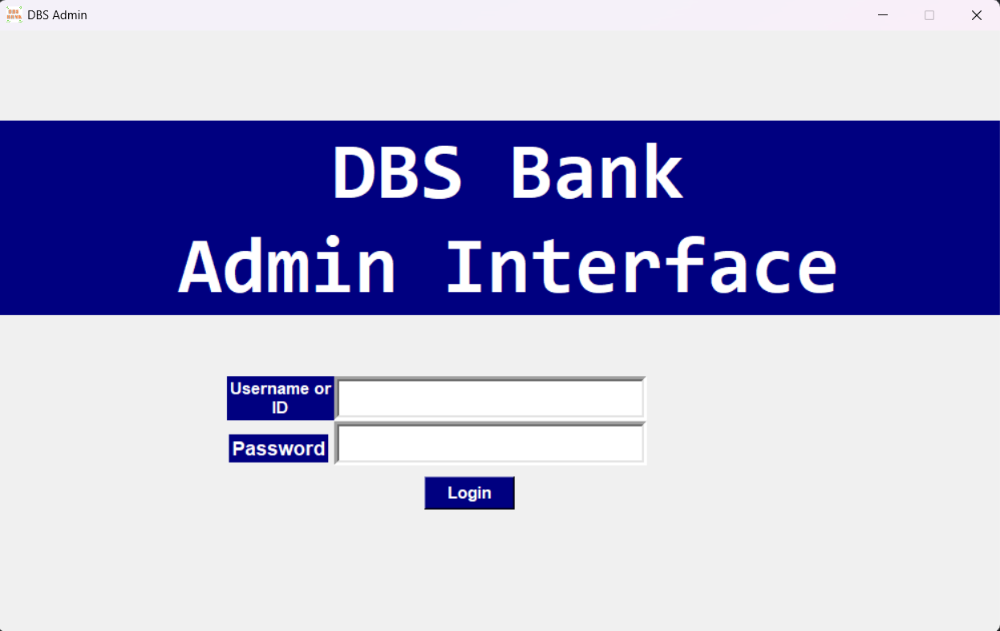
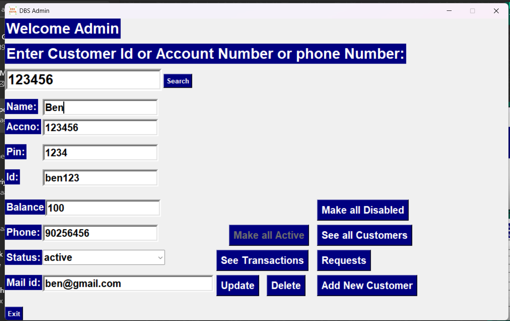

# DBS - Banking

A desktop-based banking system with a Graphical User Interface (GUI) built using Python and MySQL. This project simulates core banking functionalities for both customers and administrators. It uses Tkinter for the interface and integrates with an online MySQL database.

---

## Features

### Customer Interface
- Login using account number and user ID
- Change password from inside the app
- Reset forgotten password via registered Gmail
- Transfer money to other customers via account number or user ID
- Generate PDF receipts for every transaction using FPDF
- Retrieve past transaction receipts if missed during transfer
- View transaction history
- View profile details
- Send messages to the bank

### Admin Interface
- Admin login to access control panel
- View and modify all customer records
- View transaction history of any customer
- Temporarily block all accounts from logging in with one click
- Individually block or unblock any customer account
- Create new customer accounts
- View customers based on account number or status
- Read and delete messages sent by customers

---

## Technologies Used

- Python (Tkinter GUI)
- MySQL (online or local)
- FPDF (for PDF receipt generation)
- SMTPLib (for sending recovery emails)
- Socket (for local IP detection)
- Random and Time modules

Database credentials are managed in a separate `config.py` file with placeholders to ensure secure and public-friendly uploads.

# How to Run
## Install Required Libraries
Use pip to install the required Python packages:
```pip install fpdf mysql-connector-python```

## Configure Database Connection
Open the `config.py` file and fill in your MySQL database credentials:

## Set Up the Database
Run the `DB_Creating.py` script below to create the database and necessary tables:

## Run the Applications
-To launch the Customer Interface, run the `main.py` script
-To launch the Admin Interface, run the `Admin.py` script

## Screenshots

### Customer Login










### Admin Panel



